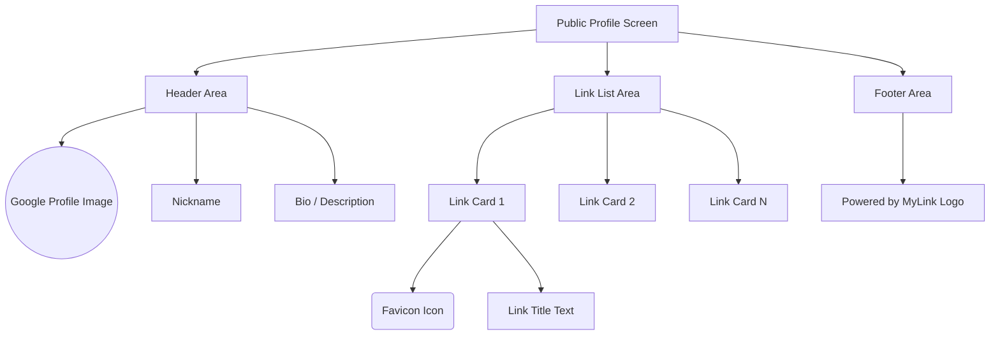
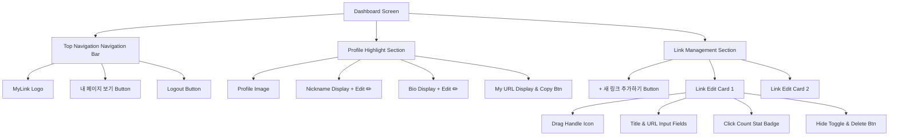

# 마이링크 (MyLink) UI 와이어프레임

해당 문서는 마이링크 서비스의 주요 화면인 **1. 퍼블릭 프로필 (방문자 뷰)**와 **2. 대시보드 (소유자 뷰)**의 UI 구조를 시각화한 와이어프레임입니다.
모든 화면은 모바일 퍼스트(Mobile-first) 기반의 세로형 레이아웃을 따릅니다.

---

## 1. 퍼블릭 프로필 화면 (Public Profile View)

방문자가 소유자의 고유 URL(`mylink.com/nickname`)로 접속했을 때 나타나는 화면입니다.

### 🎨 구조 다이어그램 (Mermaid)



### 📱 UI 모바일 뷰 (ASCII Art)

```text
+------------------------------------+
|                                    |
|             ( 이미 )               |
|             (  지  )               |
|                                    |
|             @jubindev              |
|     "프론트엔드 개발자 김주빈입니다."      |
|                                    |
|                                    |
|   +----------------------------+   |
|   | (icon)   내 기술 블로그       |   |
|   +----------------------------+   |
|                                    |
|   +----------------------------+   |
|   | (icon)   유튜브 채널         |   |
|   +----------------------------+   |
|                                    |
|   +----------------------------+   |
|   | (icon)   포트폴리오 문서      |   |
|   +----------------------------+   |
|                                    |
|                                    |
|                                    |
|          Powered by MyLink         |
|                                    |
+------------------------------------+
```

---

## 2. 대시보드 관리자 화면 (Owner Dashboard View)

소유자가 구글 로그인 후 자신의 링크를 관리하고 통계를 확인하는 중앙 제어 화면입니다.

### 🎨 구조 다이어그램 (Mermaid)



### 📱 UI 모바일 뷰 (ASCII Art)

```text
+------------------------------------+
|  [MyLink Logo] [내 페이지↗] [로그아웃] |
+------------------------------------+
|                                    |
|            ( 프로필 )              |
|            ( 사진   )              |
|                                    |
|            @jubindev ✏️            |
|   "프론트엔드 개발자 김주빈입니다." ✏️  |
|                                    |
|  🔗 주소: mylink.com/jubindev [복사]|
|                                    |
|  [   +   새로운 링크 추가하기     ]  |
|                                    |
|  +------------------------------+  |
|  | = (icon) 내 기술 블로그          |  |
|  | URL: https://blog.jubin.dev  |  |
|  | [👀 클릭 수: 142]    [ 삭제 ]   |  |
|  +------------------------------+  |
|                                    |
|  +------------------------------+  |
|  | = (icon) 유튜브 채널            |  |
|  | URL: https://youtube.com/... |  |
|  | [👀 클릭 수: 89]     [ 삭제 ]   |  |
|  +------------------------------+  |
|                                    |
|                                    |
+------------------------------------+
```

---

## 💡 누락된 요소 및 추가 시각화 제안 (개선점)

UI 와이어프레임을 그리다 보니, 사용자 경험(UX) 측면에서 다음 요소들이 화면 상에 추가되면 좋을 것으로 판단되어 제안합니다.

1. **내 프로필 공유하기(Share) 버튼 기능**
   - **현재 상태**: 프로필 주소 텍스트만 보이거나 "복사"만 존재함.
   - **제안사항**: 대시보드 상단 혹은 퍼블릭 프로필에서 소유자 본인이 볼 때, **[카카오톡 공유]**, **[QR코드 생성]** 아이콘 등을 배치하면 외부 유입을 극대화할 수 있습니다.

2. **빈 화면 (Empty State) 일러스트**
   - **현재 상태**: 가입 직후 처음 대시보드에 들어왔을 때 아래쪽 목록이 하얗게 비어 있게 됨.
   - **제안사항**: 링크가 하나도 없을 때, "*아직 등록된 링크가 없어요. 첫 번째 링크를 추가해 팬들과 공유해 보세요!*" 라는 친근한 문구와 귀여운 일러스트를 배치하여 첫 링크 추가 액션(Call To Action)을 유도해야 합니다.
